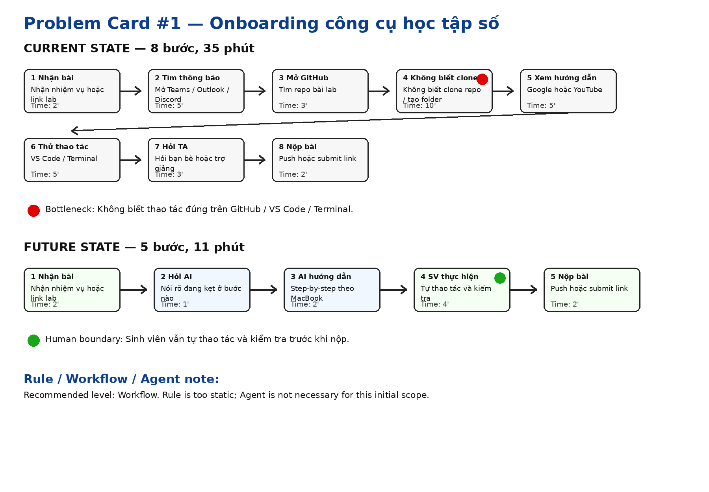
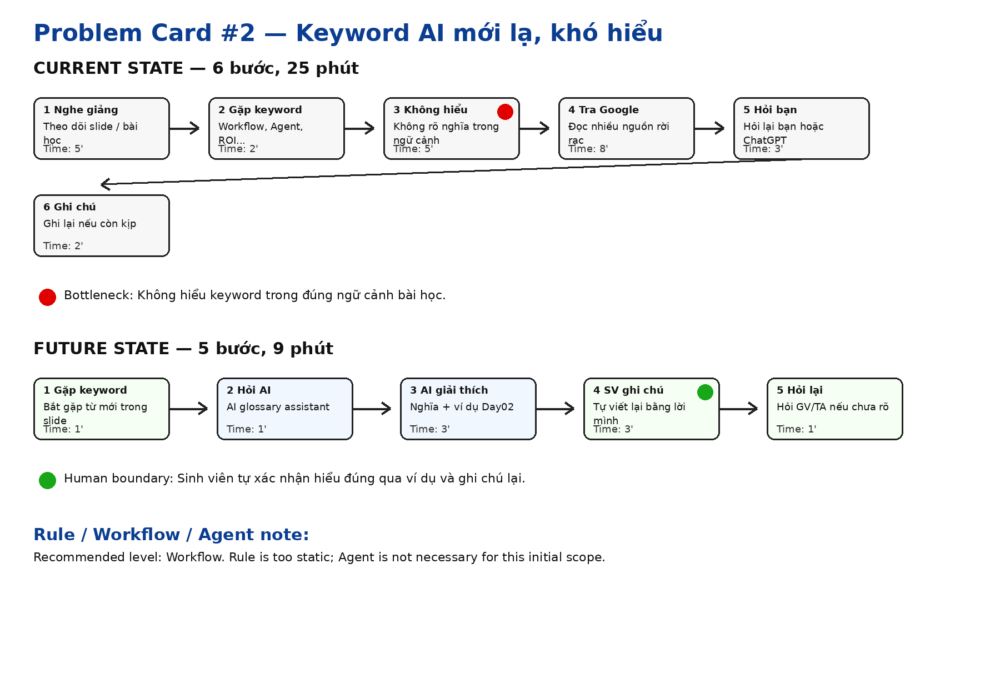
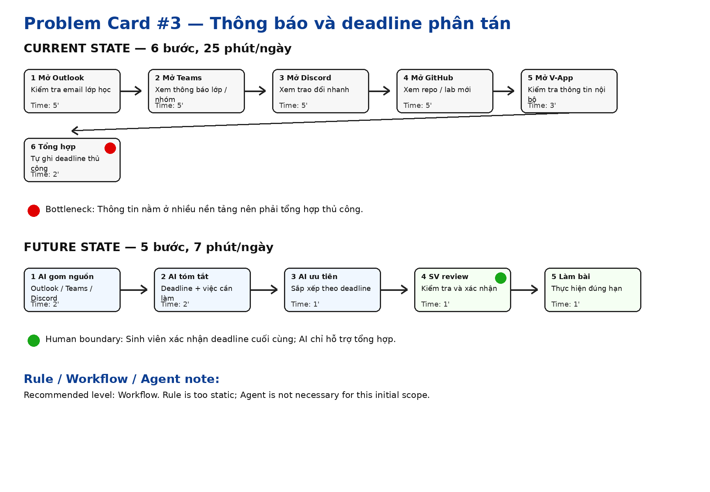

# 01 — Individual Problem Scan

> Day02 AI Product Labs — Bài cá nhân  
> Mục tiêu: scan rộng nhiều vấn đề thật, chọn Top 3 Problem Cards, và phác thảo workflow trước/sau cho từng problem.

---

## 1. Scan rộng — 10 problems

Tôi scan các vấn đề từ trải nghiệm thật của một sinh viên mới trong những ngày đầu học AI, làm lab và làm quen với môi trường học tập số.

| # | Lăng kính | Problem quan sát được | Ai đang đau? | Dấu hiệu thật |
|---|---|---|---|---|
| 1 | Lặp lại / Công cụ học tập | Chưa thành thạo GitHub khi clone repo, commit, push và nộp bài lab | Sinh viên mới | Mất khoảng 20–30 phút cho thao tác mới, thường phải hỏi bạn hoặc TA |
| 2 | Lặp lại / Công cụ học tập | Chưa quen Microsoft Teams để theo dõi lớp, nhóm và file | Sinh viên mới | Dễ bỏ sót tin nhắn, file hoặc thông báo nhóm |
| 3 | Lặp lại / Công cụ học tập | Chưa quen Outlook để kiểm tra email học tập | Sinh viên mới | Mất thời gian tìm email quan trọng, deadline hoặc thông báo |
| 4 | Lặp lại / Công cụ học tập | Chưa quen Discord để theo dõi trao đổi nhóm và thông báo nhanh | Sinh viên mới | Khó tìm lại tin nhắn cũ hoặc câu trả lời đã được gửi trước đó |
| 5 | Lặp lại / Công cụ học tập | Chưa quen V-App và các nền tảng nội bộ | Sinh viên mới | Không rõ dùng nền tảng nào cho thông tin nào |
| 6 | Tốn thời gian / Kiến thức mới | Các keyword AI như Workflow, Agent, Bottleneck, ROI, Boundary, Validation quá mới và khó hiểu | Sinh viên mới học AI | Khi nghe giảng dễ mất mạch, phải tra cứu hoặc hỏi lại nhiều lần |
| 7 | Tốn thời gian | Khi làm lab phải hỏi bạn bè/trợ giảng nhiều lần vì không chắc thao tác đúng hay sai | Sinh viên mới | Mỗi lần gặp lỗi mất 10–15 phút để hỏi và chờ phản hồi |
| 8 | Tìm kiếm thông tin | Tài liệu học tập nằm rải rác ở GitHub, Teams, Discord, slide và email | Sinh viên mới | Mất 10–20 phút để tìm đúng file hoặc đúng link |
| 9 | Làm việc nhóm | Chưa quen làm việc nhóm với người mới trong môi trường lab | Sinh viên mới | Khó phân công việc, pitch/challenge còn lúng túng |
| 10 | Môi trường mới | Chưa quen đường đi, sinh hoạt và các địa điểm xung quanh khu học tập | Sinh viên mới chuyển đến khu vực mới | Phải mở bản đồ nhiều lần, có lúc đi nhầm đường hoặc mất thêm thời gian |

### Nhận xét sau khi scan

Trong 10 problems trên, tôi thấy các vấn đề liên quan đến **học tập số, công cụ, thông tin và keyword AI** là phù hợp nhất với Day02 vì chúng có workflow rõ, có thể đo được thời gian, và có thể so sánh Rule / Workflow / Agent. Một số vấn đề đời sống như đồ ăn, đường đi hoặc bàn học cũng có thật, nhưng AI fit yếu hơn và khó phát triển thành bài AI Product Lab.

---

## 2. Top 3 Problems

| Rank | Problem | Vì sao chọn | Điều còn chưa chắc |
|---|---|---|---|
| 1 | Sinh viên mới chưa thành thạo GitHub, Teams, Outlook, Discord và V-App | Workflow rất rõ, xảy ra thường xuyên trong lab, ảnh hưởng trực tiếp đến việc học và nộp bài, có thể đo bằng thời gian hoàn thành task | Cần kiểm chứng công cụ nào gây khó khăn nhiều nhất |
| 2 | Sinh viên mới gặp quá nhiều keyword AI mới và khó hiểu | Pain rất sát buổi học Day02, ảnh hưởng trực tiếp đến khả năng hiểu bài và tham gia thảo luận | Metric hiểu bài khó đo hơn metric thời gian |
| 3 | Sinh viên mới khó theo dõi thông báo và deadline vì thông tin nằm trên nhiều nền tảng | Nhiều sinh viên có thể gặp, workflow lặp lại hằng ngày, dễ đo bằng số lần kiểm tra và số thông báo bị bỏ sót | Cần biết dữ liệu từ Teams/Outlook/Discord có thể gom lại được không |

---

# Problem Card #1 — Onboarding công cụ học tập số

## Problem 1 câu

Sinh viên mới mất nhiều thời gian để làm quen và thực hiện các thao tác cơ bản trên GitHub, Teams, Outlook, Discord và V-App, khiến việc làm lab và theo dõi học tập bị chậm trong những tuần đầu.

## Actor

Sinh viên mới tham gia chương trình AI20K/VinUni, đặc biệt là những bạn chưa quen GitHub, VS Code, Teams, Outlook, Discord và các nền tảng học tập số.

## Thời điểm / bối cảnh

Trong tuần đầu hoặc các buổi lab đầu tiên, khi sinh viên phải nhận bài, mở repo, đọc hướng dẫn, thao tác trên GitHub, theo dõi thông báo trên Teams/Outlook/Discord và nộp bài.

## Current workflow

1. Nhận nhiệm vụ hoặc link bài lab từ giảng viên/trợ giảng.
2. Mở Teams/Outlook/Discord để tìm thông tin liên quan.
3. Mở GitHub nhưng chưa biết clone repo hoặc tạo folder đúng.
4. Google hoặc xem YouTube cách làm.
5. Thử thao tác trên VS Code/Terminal.
6. Gặp lỗi hoặc không chắc làm đúng.
7. Hỏi bạn bè/trợ giảng.
8. Sửa lại và nộp bài.

## Bottleneck

Bước 3–6: sinh viên không biết thao tác đúng trên công cụ, đặc biệt là GitHub/VS Code/Terminal, nên phải tìm hướng dẫn rời rạc và hỏi nhiều lần.

## Impact

- Mỗi lab có thể mất thêm khoảng 20–30 phút chỉ vì chưa quen công cụ.
- Sinh viên dễ bị chậm so với tiến độ lớp.
- Trợ giảng phải trả lời nhiều câu hỏi lặp lại.
- Sinh viên mới dễ cảm thấy hoang mang, mất tự tin dù problem chính không phải kiến thức AI.

## Success metric

Giảm thời gian hoàn thành một thao tác học tập cơ bản từ khoảng **35 phút xuống còn dưới 12 phút**, đồng thời giảm số lần phải hỏi bạn bè/trợ giảng từ **3 lần xuống còn 0–1 lần** cho mỗi tác vụ.

## Non-AI alternative

- Tạo PDF hướng dẫn sử dụng GitHub/Teams/Outlook/Discord/V-App.
- Tạo video hướng dẫn từng công cụ.
- Tạo FAQ cố định cho các lỗi phổ biến.
- Tổ chức một buổi orientation riêng về công cụ.

## AI hypothesis

Một AI Assistant có thể hướng dẫn sinh viên từng bước theo đúng ngữ cảnh: “tôi đang ở bước clone repo”, “Terminal báo lỗi này”, “tôi không tìm thấy deadline ở đâu”. AI không làm thay sinh viên, mà đóng vai trò hướng dẫn ban đầu, giúp giảm thời gian tìm kiếm và giảm số câu hỏi lặp lại cho trợ giảng.

## Quick gut

**Workflow.**

Lý do: bài toán không cần agent tự hành phức tạp. Một workflow gồm “sinh viên hỏi → AI xác định công cụ/vấn đề → AI đưa hướng dẫn từng bước → sinh viên thực hiện → nếu vẫn lỗi thì hỏi trợ giảng” là đủ phù hợp.

## Draft workflow

---

# Problem Card #2 — Keyword AI mới lạ, khó hiểu

## Problem 1 câu

Sinh viên mới gặp nhiều thuật ngữ AI/Product như Workflow, Agent, Bottleneck, ROI, Boundary, Validation khiến việc theo dõi bài giảng bị gián đoạn và khó hiểu sâu nội dung lab.

## Actor

Sinh viên mới học AI/Product Thinking.

## Thời điểm / bối cảnh

Trong buổi học lý thuyết hoặc khi đọc slide/lab, nhiều keyword tiếng Anh xuất hiện liên tục nhưng sinh viên chưa quen với nghĩa và cách dùng trong ngữ cảnh AI Product.

## Current workflow

1. Nghe giảng hoặc đọc slide.
2. Gặp keyword tiếng Anh mới.
3. Không hiểu nghĩa trong ngữ cảnh bài học.
4. Tự đoán hoặc tra Google.
5. Mất mạch bài giảng.
6. Hỏi lại bạn/ChatGPT.
7. Ghi chú lại nếu kịp.

## Bottleneck

Bước 3–5: không hiểu keyword trong đúng ngữ cảnh Day02 nên bị mất mạch bài học.

## Impact

- Hiểu bài chậm hơn.
- Dễ hoang mang vì nhiều thuật ngữ mới xuất hiện cùng lúc.
- Khó tham gia pitch/challenge vì không chắc mình hiểu đúng khái niệm.
- Dễ nhầm giữa các khái niệm như Rule, Workflow và Agent.

## Success metric

Giảm số keyword chưa hiểu sau mỗi buổi từ khoảng **15–20 từ xuống còn 5 từ hoặc ít hơn**.

## Non-AI alternative

- Glossary cố định.
- Tài liệu song ngữ Anh–Việt.
- Giảng viên giải thích từ khóa trước buổi học.
- Nhóm tự làm bảng thuật ngữ.

## AI hypothesis

AI có thể đóng vai trò “glossary assistant”, giải thích keyword bằng tiếng Việt, kèm ví dụ đúng với bài lab hiện tại. AI nên giải thích ngắn, dễ hiểu và có ví dụ thay vì đưa định nghĩa học thuật quá dài.

## Quick gut

**Workflow.**

AI hỗ trợ giải thích theo ngữ cảnh, nhưng sinh viên vẫn phải tự học và tự ghi chú. Chưa cần agent vì không có nhiều bước hành động phức tạp.

## Draft workflow

---

# Problem Card #3 — Thông báo và deadline phân tán

## Problem 1 câu

Sinh viên mới khó theo dõi thông báo, deadline và nhiệm vụ học tập vì thông tin được gửi rải rác trên Outlook, Teams, Discord, GitHub và V-App.

## Actor

Sinh viên mới cần theo dõi lịch học, bài lab, deadline, thông báo nhóm và hướng dẫn nộp bài.

## Thời điểm / bối cảnh

Hằng ngày hoặc trước deadline, sinh viên phải kiểm tra nhiều nền tảng để chắc chắn không bỏ sót nhiệm vụ quan trọng.

## Current workflow

1. Mở Outlook để kiểm tra email.
2. Mở Teams để xem thông báo lớp/nhóm.
3. Mở Discord để xem trao đổi nhanh.
4. Mở GitHub để xem repo/lab mới.
5. Mở V-App hoặc nền tảng nội bộ nếu cần.
6. Tự ghi chú deadline.
7. Làm bài hoặc nhắc nhóm.

## Bottleneck

Bước 1–6: thông tin nằm ở quá nhiều nơi, sinh viên phải tổng hợp thủ công và dễ bỏ sót thông báo quan trọng.

## Impact

- Mất khoảng 15–25 phút/ngày để kiểm tra thông tin học tập.
- Dễ bỏ sót deadline hoặc link bài tập.
- Sinh viên cảm thấy căng thẳng vì không chắc mình đã kiểm tra đủ nguồn.
- Việc làm nhóm có thể bị chậm nếu một thành viên bỏ sót thông báo.

## Success metric

Giảm thời gian kiểm tra thông báo từ khoảng **25 phút/ngày xuống còn dưới 7 phút/ngày**, đồng thời giảm số deadline/thông báo bị bỏ sót.

## Non-AI alternative

- Một dashboard chung ghi deadline.
- Calendar chung cho lớp.
- Ghim thông báo quan trọng trên Teams/Discord.
- Google Sheet tổng hợp deadline.

## AI hypothesis

Một AI notification assistant có thể tổng hợp thông báo từ nhiều nguồn thành một danh sách ngắn: deadline, việc cần làm, link liên quan và mức độ ưu tiên. AI không tự quyết định thay sinh viên mà chỉ hỗ trợ tổng hợp và nhắc lại.

## Quick gut

**Workflow.**

Workflow phù hợp vì bài toán là gom và tóm tắt thông tin theo quy trình cố định. Agent chưa cần thiết vì AI không cần tự lập kế hoạch phức tạp hay thực hiện hành động thay sinh viên.

## Draft workflow

---

# So sánh Top 3

| Card | Actor | Bottleneck | Metric | Quick gut | Vì sao chưa chọn làm #1 |
|---|---|---|---|---|---|
| Onboarding công cụ học tập số | Sinh viên mới | Không biết thao tác GitHub/VS Code/Teams | 35 phút → 11 phút | Workflow | Chọn làm #1 vì workflow rõ nhất |
| Keyword AI khó hiểu | Sinh viên mới học AI | Không hiểu keyword trong ngữ cảnh | 15–20 từ chưa hiểu → ≤5 từ | Workflow | Metric hiểu bài khó đo hơn thời gian thao tác |
| Thông báo/deadline phân tán | Sinh viên mới | Tổng hợp thông tin từ nhiều nền tảng | 25 phút/ngày → ≤7 phút/ngày | Workflow | Cần quyền truy cập và đồng bộ dữ liệu từ nhiều nguồn |

---

# Tự đánh giá phần cá nhân

## Vì sao bài scan này mạnh?

- Có scan rộng 10 problems trước khi chọn Top 3.
- Top 3 đều đến từ trải nghiệm thật của sinh viên mới.
- Mỗi problem có actor, workflow, bottleneck, impact và metric.
- Không bắt đầu bằng “xây chatbot” hay “xây agent”, mà bắt đầu từ pain point thật.
- Cả 3 problem đều có thể so sánh Rule / Workflow / Agent.
- Problem #1 có workflow và metric rõ nhất nên phù hợp để pitch với nhóm.

## Card muốn pitch nhất

**Problem Card #1 — Onboarding công cụ học tập số.**

## Vì sao?

Vì đây là pain xuất hiện ngay trong các buổi lab đầu tiên, có ảnh hưởng trực tiếp đến việc làm bài, có thể đo bằng thời gian thao tác và có thể giải quyết bằng một AI workflow tương đối đơn giản.

## Câu hỏi muốn nhóm challenge

- Vấn đề này có phải chỉ xảy ra với cá nhân tôi hay nhiều sinh viên mới cũng gặp?
- Công cụ nào gây bottleneck lớn nhất: GitHub, Teams, Outlook, Discord hay V-App?
- Dùng PDF/video hướng dẫn có đủ chưa, hay AI Assistant thật sự tạo thêm giá trị?
- Nếu dùng AI, làm sao tránh hướng dẫn sai giao diện hoặc sai version?

---

# Ghi chú sử dụng AI

Tôi có dùng AI để hỗ trợ sắp xếp ý tưởng, phản biện Problem Cards và viết lại workflow rõ ràng hơn. Tuy nhiên, các pain points chính đến từ trải nghiệm thật của tôi khi mới làm quen với công cụ học tập, keyword AI và nhiều kênh thông tin khác nhau.
